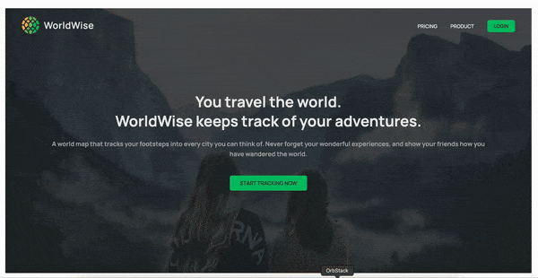

# WorldWise

This is an SPA built with Vite and React routing. It allows users to mark on the map and add cities that they visited, as well as leaving some notes about their trips. 

## To run the project:

At the root of the project run

``npm run server`` (to fire up a fake server)
``npm run dev`` (to start application)

